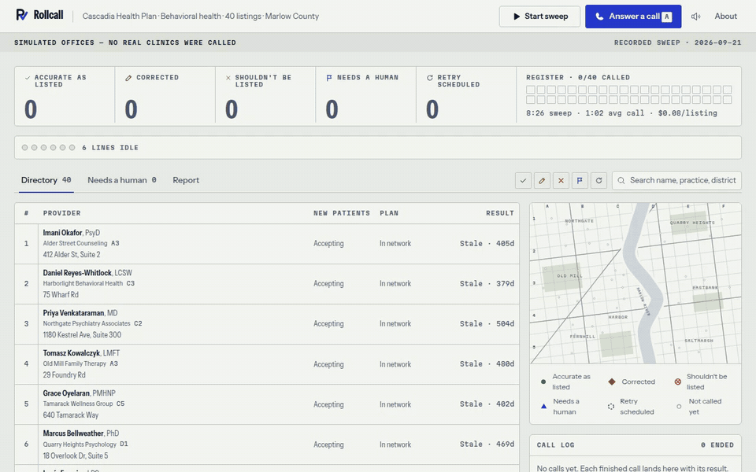
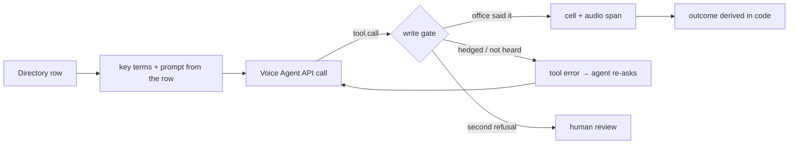

# Rollcall

**It phones every doctor's office on a health plan's list, fixes the list, and keeps the clip behind every change.**

**Live: https://rollcall-sage.vercel.app** · [slides](docs/submission/slides.pdf) · [how it is built](#application-of-technology)



Built on the AssemblyAI Voice Agent API for the [AssemblyAI Voice Agent Hackathon](https://lablab.ai/ai-hackathons/assemblyai-voice-agent-hackathon) (lablab.ai, September 2026).

> Every office in this project is simulated. No real clinic was called, and every phone number is in the 555-01xx range reserved for fiction.

## The problem

US Senate Finance Committee staff called 120 mental-health listings from 12 Medicare Advantage directories. A third were wrong or unreachable and they could book an appointment [18% of the time](https://www.finance.senate.gov/chairmans-news/wyden-calls-for-action-to-get-rid-of-ghost-networks-releases-secret-shopper-study). The No Surprises Act already requires plans to verify every listing every 90 days; the REAL Health Providers Act makes that proactive from plan year 2028. Today that is a call centre asking the same five questions.

## What it does

1. **Sweep.** One click. Six lines dial 40 offices. Each call checks five facts in three questions: still here; address and booking phone; new patients and in network.
2. **Write, with evidence.** Every clear answer becomes one tool call. Confirmed cells get a tick; corrected cells show the old value struck through beside the new one. Click any cell to hear the receptionist say it.
3. **Refuse to guess.** "I think he's still taking patients?" is not written down. It goes to a person, with the clip.
4. **Your turn.** Answer a call in the browser and play the front desk. What you say becomes row 41.
5. **Report.** A printable attestation sheet and a corrections CSV.

## Application of Technology

| AssemblyAI feature | What it carries here |
|---|---|
| Voice Agent API, one WebSocket | Both ends of every recorded call (Rollcall and the simulated front desk), and the visitor's live call from the browser |
| `input.keyterms` + `transcription_prompt` | Built per call **from the row being verified**: the provider's surname, the practice, the street, the plan (`lib/agent/session.ts`) |
| JSON-schema function tools | Seven tools; each clear answer is exactly one call (`lib/agent/tools.ts`) |
| `tool.result` with `is_error` | The write gate's refusals go back to the model as instructions ("'2310' was not heard. Ask them to repeat the street number.") |
| Turn detection and barge-in, left on adaptive defaults | Front desks interrupt, say "hold please", and read numbers slowly |
| Temporary tokens (`GET /v1/token`) | The browser never sees the API key; each token caps the session at 180s (`app/api/token`) |
| `reply.create` | If the visitor picks up and says nothing, the agent says hello first |
| No `greeting` | The office answers first, as on a real call |
| `execution_mode` per call type | `hold` for recorded calls (faster), `interactive` with a spoken "Got it." for live ones (no dead air) |
| Voice-gated input (`lib/agent/voice-gate.ts`) | Audio is sent only around speech; a continuous stream measurably delays turn detection (`docs/adr/0005`) |

**The write gate** (`lib/agent/gate.ts`) is code, not prompt. A value reaches the directory only if the office's own words support it: numbers in a new address or phone must have been heard (in any spoken form), a hedged answer is refused, the second refusal sends the field to a human, and the call's outcome is derived from what was written (`lib/agent/outcome.ts`), never taken from the model.



## Business Value

- **Buyer:** the provider-data team at a health plan. The work is mandated every 90 days and is done today by phone.
- **Cost per listing** is computed from the calls themselves and shown on the console (about $0.05 at the $0.075/min Voice Agent rate for a 43-second call).
- **Prior art:** enterprise vendors sell this to large plans, which validates the buyer. Rollcall's wedge is the evidence trail and the refusal to guess.
- **Next:** the same engine fills any column that only a phone call can answer.

## Originality

Most voice agents replace a receptionist. This one calls them, many at once, and treats every answer as a claim that needs a receipt.

## Presentation

The console is a register, a wall map and a six-line desk phone (`DESIGN.md`, `UI-SPEC.md`). `/_kit` shows every component in every state.

## Evidence, criterion by criterion

| Criterion | Where to look |
|---|---|
| Application of Technology | `lib/agent/` (tools, session builder, write gate, live driver), `scripts/lib/bridge.ts`, ADRs 0001, 0005, 0006 |
| Presentation | the console at `/`, every component and state at `/_kit`, `DESIGN.md`, `UI-SPEC.md` |
| Business Value | `/about` (the rule, the benchmark, cost per listing), `/report` (the artifact a plan would file) |
| Originality | click a struck-through cell; open *Needs a human*; open any transcript with a red "Refused by the gate" row |
| Does it work? | `npm run verify` (no credentials), `npm run eval` (40/40 outcomes, 150/150 written fields, 0 false writes), `tests/replay.test.ts` replays every recorded call through the gate |

## What is real and what is simulated

| Real | Simulated |
|---|---|
| The agent, its tools, the write gate, outcome derivation, the live browser call | Every office, provider, address and phone number |
| All 40 calls on the console: recorded through the Voice Agent API, with their audio | The health plan and the county |
| `npm run verify`: 121 tests + 12 checks over the recorded data, no credentials | The front desks are language models playing scripted offices; real ones have phone menus and hold queues |

Scored against the offices' hidden truth sheets (`npm run eval`): 40 of 40 outcomes, 150 of 150 written fields, 0 false writes; the gate refused 5 tool calls. Three listings were re-recorded after the bug they exposed was fixed in code; the other 37 are first takes. Each of those bugs is now a test built from the real call.

## Run it

```bash
npm install
npm run dev        # http://localhost:3210, demo mode, no key needed
npm run verify     # typecheck + tests + judge-check, prints PASS/FAIL
```

With a key (`ASSEMBLYAI_API_KEY=...` in `.env.local`): `npm run check:keys`, then `npm run record`, `npm run import:recordings`, `npm run eval`.

## Limitations

- English only. One network, one call script.
- The simulated front desks are language models too; real offices have phone menus and hold queues this does not navigate yet.
- The live-call budget limiter is in memory per server instance. The app does not rely on server-side session caps: the UI ends every call at 150 seconds, budgets are low, and the account runs on prepaid credits.
- A visitor's call audio lives in the browser tab and is gone after a refresh; the row and transcript persist.

## AI use

Built with Claude Code. Design and build decisions are recorded in `DESIGN.md`, `UI-SPEC.md` and `docs/adr/`. MIT licensed.
